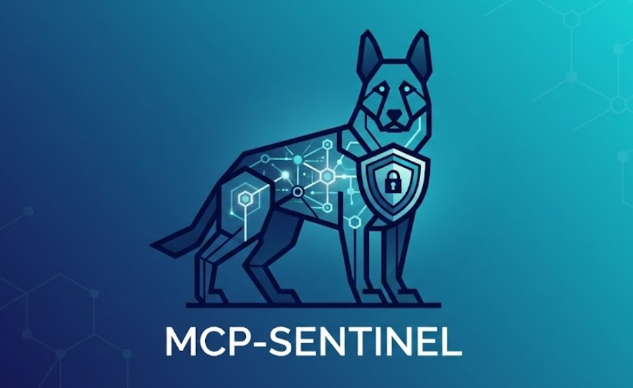

<p align="center">
  
</p>

# MCP-Sentinel

**Zero Trust orchestration and security framework for AI Agents operating under the [Model Context Protocol (MCP)](https://modelcontextprotocol.io/).**

MCP-Sentinel allows AI agents to execute commands on remote infrastructure in an audited, restricted manner with Human-in-the-Loop (HITL) validation. It follows a Zero Trust model: every execution request is authenticated, authorized via RBAC, cryptographically signed, and optionally gated by a 2FA approval step before reaching the target host.

Architecture is modeled after **OpenStack's distributed microservices pattern**.

---

## Key Features

- **Zero Trust by default** — all commands are denied unless explicitly allowed in a Command Set
- **RSA-SHA256 payload signing** — agents verify every payload's signature before execution; unsigned or tampered payloads are silently discarded
- **Human-in-the-Loop (HITL)** — high-risk commands require explicit human approval via a pluggable 2FA provider (Telegram Bot included)
- **RBAC policy engine** — fine-grained policies binding agents, host groups, and command sets with per-command argument regex whitelists and optional filesystem path restrictions (`allowed_paths`)
- **Immutable CADF audit log** — every execution attempt is recorded with full context
- **No inbound ports on agents** — agents are pure message consumers (RabbitMQ), they never open listening sockets
- **Plugin architecture** — execution drivers (`posix_bash`, `ansible`, `openstack_sdk`) and 2FA providers (`telegram`, `stub`) are loaded via `stevedore`
- **Built-in command sets** — four ready-to-use command sets (`linux_diagnostics`, `log_reader`, `service_management`, `network_diagnostics`) are seeded automatically on first run

---

## Architecture

```
┌─────────────────────────────────────────────────────────────────┐
│                        CONTROL PLANE                            │
│                                                                 │
│  ┌──────────────┐    ┌──────────────────┐    ┌──────────────┐  │
│  │sentinel-     │    │sentinel-conductor│    │sentinel-     │  │
│  │mcp-api       │───▶│                  │───▶│scheduler     │  │
│  │(MCP Gateway) │    │ RBAC + 2FA +     │    │              │  │
│  └──────────────┘    │ RSA signing +    │    │ Heartbeat    │  │
│                      │ Audit logs       │    │ tracker +    │  │
│  ┌──────────────┐    │                  │    │ router       │  │
│  │sentinel-     │───▶│ (only component  │    └──────────────┘  │
│  │admin-api     │    │  with DB access) │                      │
│  │(REST API)    │    └──────────────────┘                      │
│  └──────────────┘                                              │
└───────────────────────────────────┬─────────────────────────────┘
                                    │ RabbitMQ
                                    ▼
┌─────────────────────────────────────────────────────────────────┐
│                       EXECUTION PLANE                           │
│                                                                 │
│  ┌──────────────────────────────────────────────────────────┐  │
│  │ sentinel-agent  (one per target host, unprivileged user) │  │
│  │                                                          │  │
│  │  1. Verify RSA signature                                 │  │
│  │  2. Load driver via stevedore (posix_bash / ansible)     │  │
│  │  3. Validate args against regex whitelist                │  │
│  │  4. Execute → emit result + audit event                  │  │
│  └──────────────────────────────────────────────────────────┘  │
└─────────────────────────────────────────────────────────────────┘
```

### Components

| Component | Role |
|---|---|
| `sentinel-mcp-api` | MCP Streamable HTTP gateway; translates LLM tool calls into internal bus requests |
| `sentinel-admin-api` | RESTful API for human admins; CRUD for policies, groups, agents, audit log queries |
| `sentinel-conductor` | The only component with DB access. Evaluates RBAC, manages 2FA, RSA-signs payloads, writes CADF audit logs |
| `sentinel-scheduler` | Tracks agent heartbeats; routes signed messages to the correct agent queue |
| `sentinel-agent` | Lightweight daemon on target hosts. No listening ports — consumes its own RabbitMQ queue |
| `sentinel-cli` | `cliff`-based CLI (`sentinel host list`, `sentinel policy create`, etc.) |

---

## Quick Start (Docker Compose)

### Prerequisites

- Docker + Docker Compose v2
- A Telegram Bot token (from [@BotFather](https://t.me/BotFather)) — or use `provider = stub` for dev/testing

### 1. Clone and configure

```bash
git clone https://github.com/your-org/sentinel.git
cd sentinel

# Copy the example config and fill in your values
cp config/sentinel.dev.conf.example config/sentinel.dev.conf
# Edit config/sentinel.dev.conf:
#   - Set [telegram] bot_token and approver_chat_id
#   - Or set [auth] provider = stub to skip Telegram
```

### 2. Start the control plane

```bash
docker compose up --build -d
```

This starts: PostgreSQL, RabbitMQ, sentinel-conductor, sentinel-scheduler, sentinel-mcp-api, and sentinel-admin-api.

> **Agents are not included** in the main compose. See [docs/deployment.md](docs/deployment.md) for the three agent deployment options.

### 3. Seed built-in command sets (optional)

```bash
SENTINEL_SEED_DEFAULTS=true docker compose restart conductor
```

This inserts four ready-to-use command sets: `linux_diagnostics`, `log_reader`, `service_management`, and `network_diagnostics`. Safe to run multiple times — existing sets are skipped.

### 4. Start a test agent

```bash
cp config/sentinel.agent-test.conf.example config/sentinel.agent-test.conf
docker compose -f docker-compose.agent-test.yml up -d --build
```

The test agent has a fixed identity (`sentinel-agent-test`) that survives container recreations.

### 5. Login with the CLI

```bash
pip install -e .
export SENTINEL_API_URL=http://localhost:8001
sentinel login -u admin
# Password: sentinel-admin-dev  (change this before production!)
```

### 6. Create a policy and run a command

```bash
# The test agent auto-registers on first heartbeat (~30 seconds)
sentinel host list

# Create a host group and add the agent
sentinel group create dev-agents
sentinel group member add <GROUP_ID> sentinel-agent-test

# Use a seeded command set
sentinel commandset list

# Bind to the group for a given AI agent identity
sentinel policy create llm-agent-claude <COMMANDSET_ID> --target-group <GROUP_ID>

# Check audit logs
sentinel audit log list --limit 20
```

---

## Security Model

### Command Sets

Every allowed command is declared in a Command Set with:
- `binary` — absolute path to the executable
- `args_regex` — whitelist regex for arguments (default deny on mismatch)
- `allowed_paths` — optional list of filesystem path prefixes; any argument starting with `/` must match at least one prefix (double-enforced: conductor RBAC + agent driver)
- `require_2fa` — if `true`, blocks until a human approves via the 2FA plugin
- `driver` — execution backend (`posix_bash`, `ansible`, `openstack_sdk`)

```yaml
# Example command set
driver: posix_bash
commands:
  - name: tail_log
    binary: /usr/bin/tail
    args_regex: "^-n \\d{1,4} .+$"
    allowed_paths: ["/var/log/"]   # path-like args must be under /var/log/
    require_2fa: false

  - name: restart_web
    binary: /usr/bin/systemctl
    args_regex: "^restart (nginx|apache2)$"
    require_2fa: true   # requires Telegram approval
```

### Built-in Command Sets

Four command sets are seeded automatically when `SENTINEL_SEED_DEFAULTS=true` is set:

| Name | Driver | 2FA | Description |
|------|--------|-----|-------------|
| `linux_diagnostics` | `posix_bash` | No | uptime, df, free, ps, uname, hostname |
| `log_reader` | `posix_bash` | No | tail, ls, grep — restricted to `/var/log/` |
| `service_management` | `posix_bash` | For mutating ops | systemctl status/list (no 2FA), restart/stop/start (2FA) |
| `network_diagnostics` | `posix_bash` | No | ping, ss, dig, ip |

### Payload Signing

```
Conductor signs payload (RSA-SHA256, 4096-bit)
         │
         ▼
Scheduler routes to agent queue
         │
         ▼
Agent verifies signature ──── FAIL ──▶ discard + alert (never execute)
         │
        PASS
         │
         ▼
Execute command
```

Replay protection: payloads older than 120 seconds or with future timestamps (>30s clock skew) are rejected.

### 2FA Flow (Telegram)

```
Conductor receives high-risk request
         │
         ▼
Sends Telegram message with [Approve] / [Reject] buttons
         │
   Human decides
    ┌────┴────┐
  Approve   Reject
    │          │
    ▼          ▼
 Execute    Deny + audit log
```

---

## Tech Stack

| Layer | Technology |
|---|---|
| Language | Python 3.10+ |
| Async Messaging | `oslo.messaging` over RabbitMQ |
| Configuration | `oslo.config` |
| Plugin system | `stevedore` |
| CLI | `cliff` |
| Data validation | `pydantic` v2 |
| Persistence | SQLAlchemy + PostgreSQL |
| MCP Gateway | FastAPI (Streamable HTTP transport) |
| Admin API | FastAPI + JWT auth |
| Migrations | Alembic |

---

## Project Structure

```
sentinel/
├── sentinel/
│   ├── common/               # Shared config, models, schemas, messaging, crypto, fixtures
│   ├── sentinel_conductor/   # RBAC engine, 2FA, RSA signing, audit, seeder
│   ├── sentinel_scheduler/   # Heartbeat registry, message routing
│   ├── sentinel_agent/       # Execution drivers, payload verification
│   ├── sentinel_mcp_api/     # MCP Streamable HTTP gateway
│   ├── sentinel_admin_api/   # REST admin API
│   └── sentinel_cli/         # cliff-based CLI
├── config/
│   ├── sentinel.dev.conf.example        # Control plane config
│   ├── sentinel.agent-test.conf.example # Test container agent config
│   └── sentinel.agent-host.conf.example # Real host agent config
├── scripts/
│   └── install-agent.sh      # Installer for real Linux hosts
├── docker/
├── docker-compose.yml                   # Control plane only
├── docker-compose.agent-test.yml        # Test agent (fixed identity)
├── docs/
│   ├── deployment.md         # Agent deployment options
│   ├── agent-install.md      # Real host installation guide
│   ├── admin-api.md          # Admin REST API reference
│   ├── mcp-api.md            # MCP API reference
│   └── cli.md                # CLI reference
└── setup.cfg
```

---

## Documentation

| Document | Description |
|----------|-------------|
| [docs/deployment.md](docs/deployment.md) | The three agent deployment options and when to use each |
| [docs/agent-install.md](docs/agent-install.md) | Full guide for installing the agent on a real Linux host |
| [docs/admin-api.md](docs/admin-api.md) | Admin REST API reference |
| [docs/mcp-api.md](docs/mcp-api.md) | MCP API reference (for AI agents) |
| [docs/cli.md](docs/cli.md) | `sentinel` CLI command reference |

---

## Development

```bash
# Install in editable mode (all components + dev extras)
pip install -e ".[dev]"

# Run tests
pytest tests/

# Start infrastructure only (RabbitMQ + PostgreSQL)
docker compose up -d rabbitmq postgres

# Run services locally against the Docker infra
SENTINEL_CONF=config/sentinel.dev.conf sentinel-conductor
SENTINEL_CONF=config/sentinel.dev.conf sentinel-agent
```

---

## Stevedore Plugin Namespaces

| Namespace | Available drivers |
|---|---|
| `sentinel.agent.drivers` | `posix_bash`, `ansible` (optional), `openstack_sdk` (optional) |
| `sentinel.auth.providers` | `telegram`, `stub` (dev/testing) |

---

## Contributing

Contributions are welcome. Please open an issue before submitting a pull request for significant changes.

1. Fork the repository
2. Create a feature branch (`git checkout -b feature/my-feature`)
3. Commit your changes
4. Open a pull request

---

## License

Apache License 2.0 — see [LICENSE](LICENSE).
